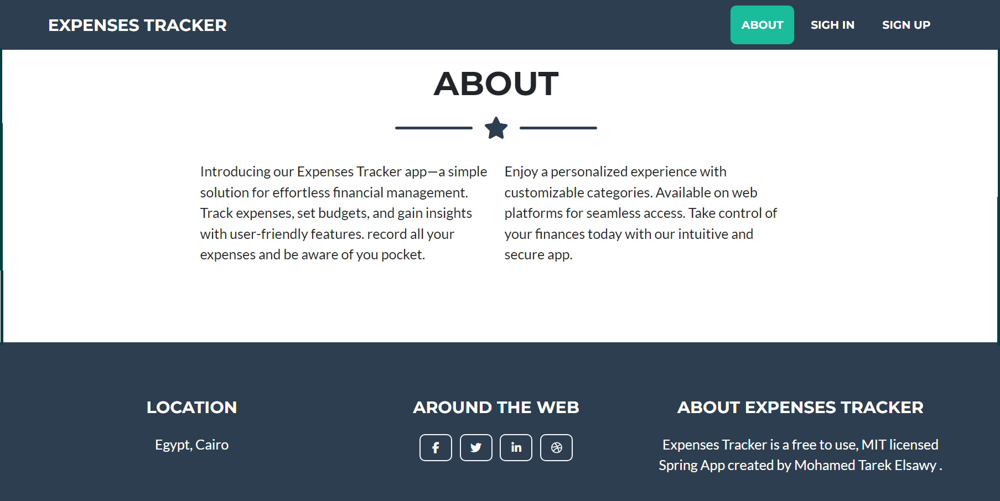
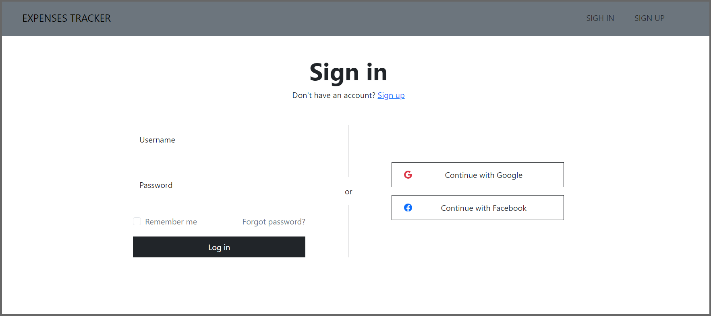
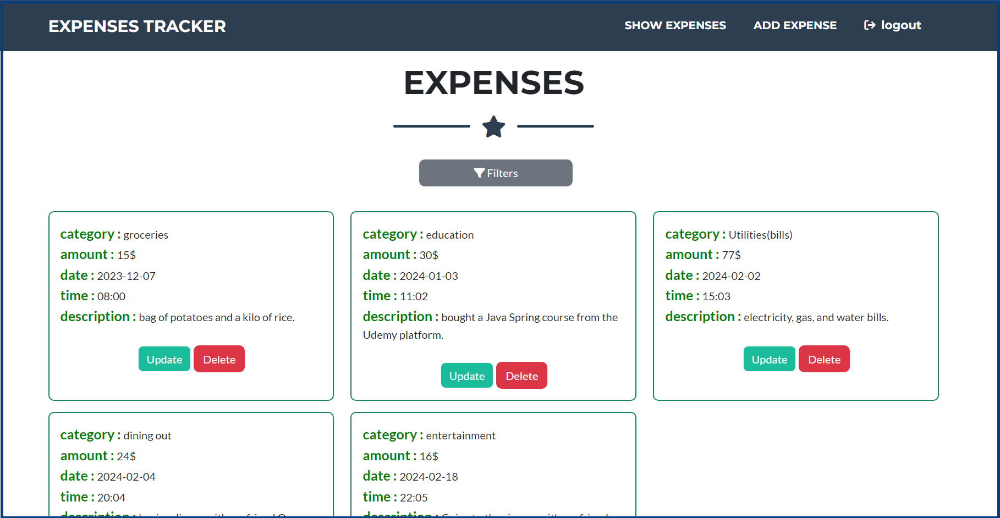
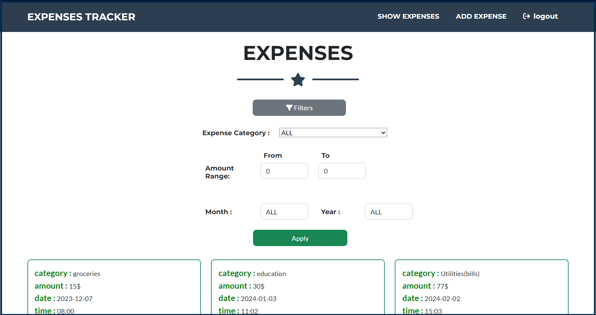
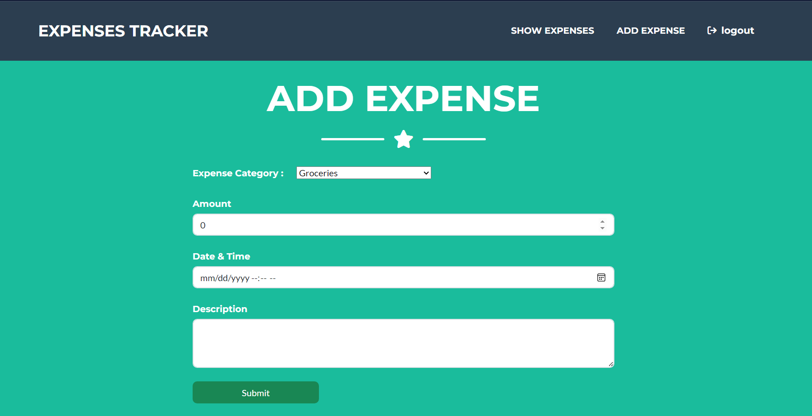

# Deployment-of-3-tier-JAVA-app-using-docker-compose
## Overview
The Expenses Tracker App is a robust financial management solution developed using cutting-edge technologies such as Spring Boot, Spring Security, and MySQL. With user authentication and authorization features, users can securely sign up, sign in, and perform CRUD operations on their expenses. The app's intuitive interface, powered by Thymeleaf and Bootstrap, ensures a seamless user experience. The filtering functionality allows users to efficiently organize and analyze their financial data. Explore the power of streamlined expense tracking and financial control with this feature-rich application.  (Screenshots below for more illustration)

## Technologies Used
- Java
- Thymeleaf
- Bootstrap
- MySQL
- Dockerfile
- docker-compose.yml
- Nginx reverse Proxy
- 

## Getting Started

# Step -1:
First install docker and docker-compose in your system
` apt update -y `
`apt install docker.io -y`
` apt install docker-compose -y`
` docker -v`
`docker-compose --version`

1. **Clone the Repository:**
`git clone https://github.com/muhammadaliazhar/Deployment-of-3-tier-JAVA-app-using-docker-compose.git`

# Step 2
` cd project-folder`

# Step-3 Build and run application using docker-compose
`docker-compose up`
`docker ps`

# Step - 4 Access the App
Open your web browser and navigate to `public-ip-adrress`

## ScreenShots
  
  
  
  
  
  
  
  

## Contributions
Contributions are welcome! If you find a bug or have suggestions for improvement, feel free to open an issue or create a pull request.

## License
This project is licensed under the MIT License.
